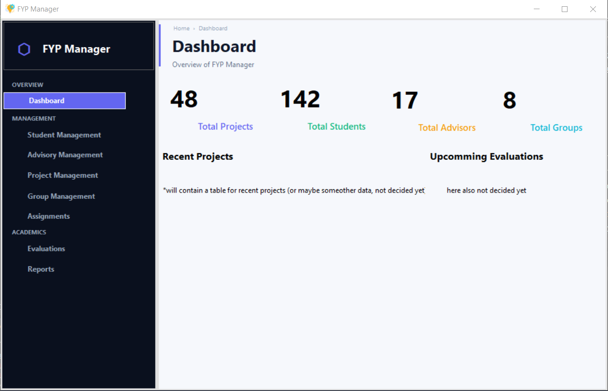
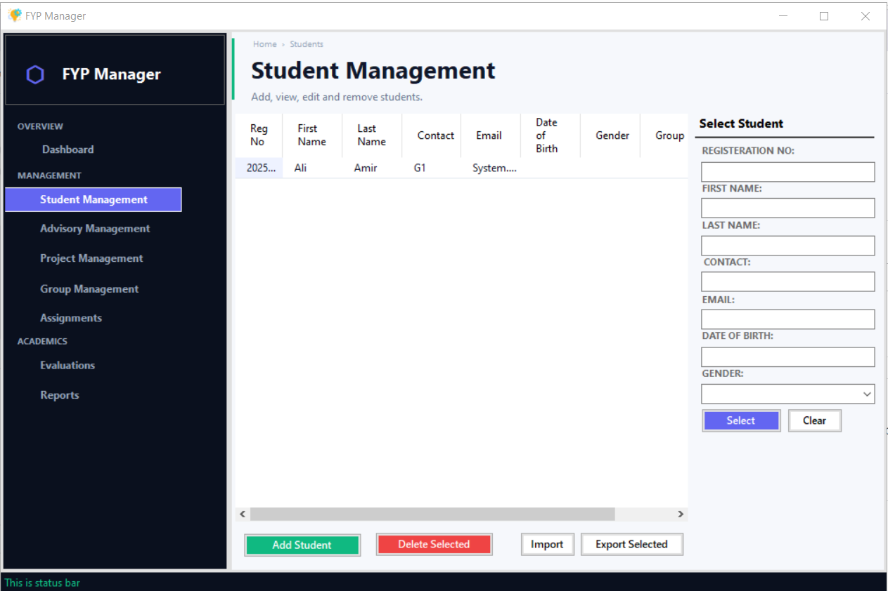
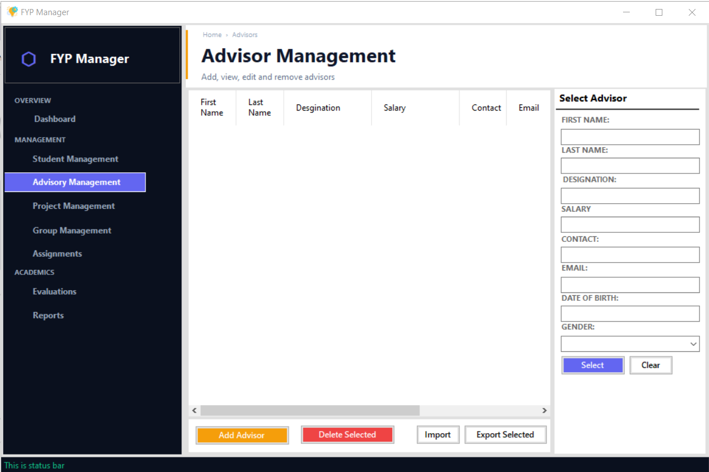
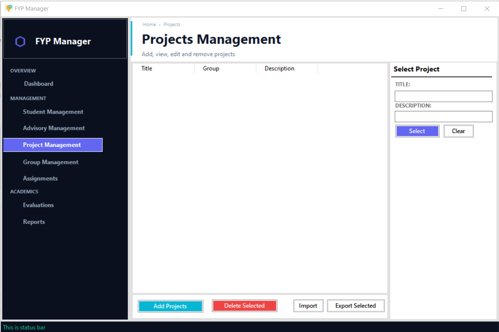
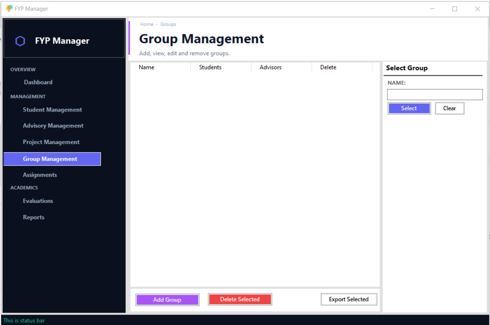
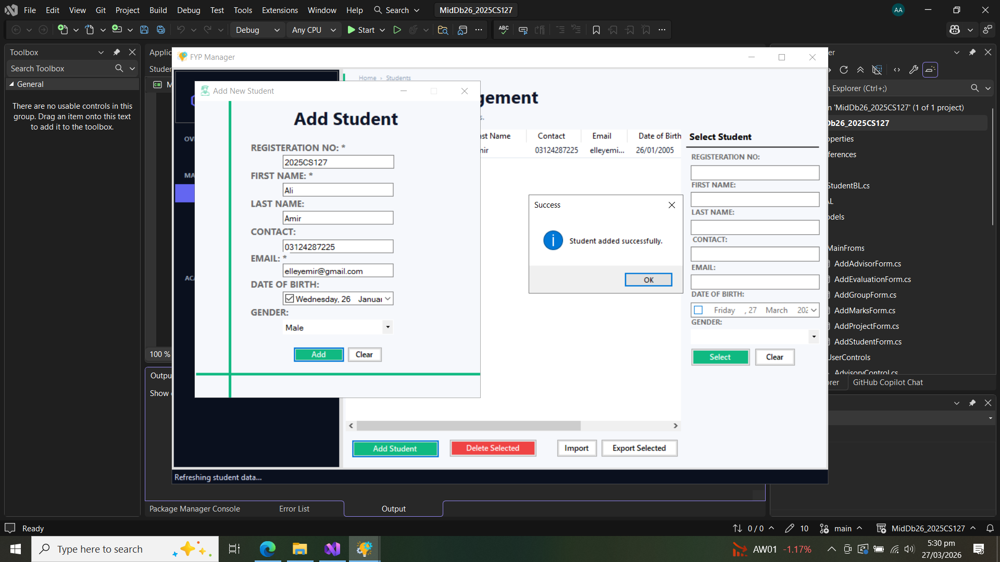

# MidDb26_2025CS127

  

## Project Overview

Currently ongoing database project as mid term project. In this project we are developing a database-driven application, for final year projects management.

  

## Tasks Completed So Far

- Basic structure of project.
- UI is almost done.
- Validation Utility added
- Updated Database helper class to support transactions
- Student management is completed

  

## UI Screenshots

-  - Screenshot of main application dashboard.

-  - Screenshot of student management screen.

-  - Screenshot of advisory management screen.

-  - Screenshot of project management screen.

-  - Screenshot of group management screen.

 -  - Screenshot of student being added.

Note: This is a work-in-progress overview. I will add full featrue documentation as the project progresses.